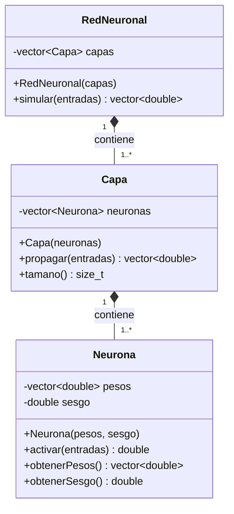

# Diagrama de clases — Red Neuronal MVP

```mermaid
classDiagram
    class Neurona {
        -vector~double~ pesos
        -double sesgo
        +Neurona(pesos, sesgo)
        +activar(entradas) double
        +obtenerPesos() vector~double~
        +obtenerSesgo() double
    }

    class Capa {
        -vector~Neurona~ neuronas
        +Capa(neuronas)
        +propagar(entradas) vector~double~
        +tamano() size_t
    }

    class RedNeuronal {
        -vector~Capa~ capas
        +RedNeuronal(capas)
        +simular(entradas) vector~double~
    }

    RedNeuronal "1" *-- "1..*" Capa : contiene
    Capa "1" *-- "1..*" Neurona : contiene
```
